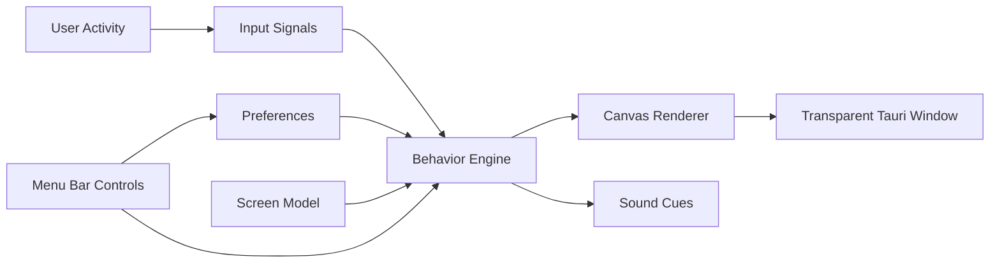

# Architecture

PawPal is split into a small native desktop shell and a frontend runtime.

## Boundaries

- Rust owns native windows, tray/menu commands, and OS integration.
- TypeScript owns pet behavior, rendering, preferences shape, and animation.
- Assets are data, not hardcoded behavior.

## Repository Contracts

- `src/core` is framework-light logic and should be easy to test.
- `src/ui` is React and canvas integration.
- `src-tauri` should stay small until native behavior truly needs Rust.
